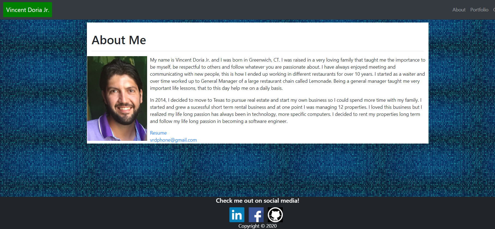
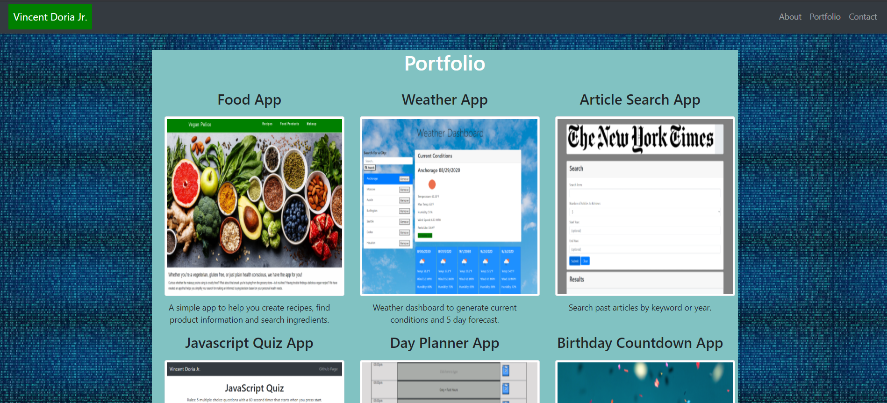

# 📃 [Responsive Portfolio](https://cenzo-cmd.github.io/Responsive-Portfolio/) 📃

“Choose a job you love, and you will never have to work a day in your life." —Confucius

 

Technology has always been a passion for me ever since my first computer which ran on windows 3.1.  After working in restaurants, real estate and construction, I decided to follow my passion and pursue a career in it.  This is my responsive resume which can be viewed on a computer or a phone.  There are 3 pages, the about me page, my portfolio and a contact form.  The nav bar is responsive and when viewed on small devices, it will collapse into a "hamburger" nav icon.  When the "hamburger is click, it will display the pages associated with my resume.  The footer contains links to view my LinkedIn, Facebook and GitHub pages.

 
I have included some of my projects that I have worked on the past few months under my portfolio page.  Clicking on the image will bring you to a link to view the app.  My email and resume are included in the contant page and I would love to hear what you think!

-Vincent

https://cenzo-cmd.github.io/Responsive-Portfolio/
